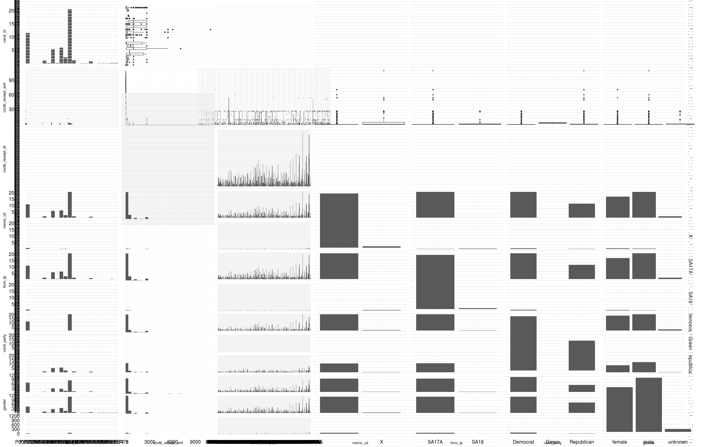

Exploration of California's Contributions to 2016 Presidential Campaigns by Alf
========================================================

```{r echo=FALSE, message=FALSE, warning=FALSE, packages}
# Load all of the packages
library(ggplot2)
library(gender)
library(dplyr)
library(GGally)
library(gridExtra)
library(scales)
library(RColorBrewer)
# to install choroplethrzip
#library(devtools)
# to retrieve census data
#library(acs)
library(choroplethr)
library(choroplethrZip)
```

```{r echo=FALSE, eval=FALSE, choropleth_reference_only}
# These packages were installed to create choropleth maps in this project
install.packages("choroplethr", dependencies = TRUE)
install.packages("devtools", dependencies = TRUE)
install_github('arilamstein/choroplethrZip@v1.5.0')
install.packages("acs", dependencies=TRUE)
# my api key from census data
api.key.install("mykeyfromcensusdotgov", file="key.rda")
```

I used the dataset "Financial Contributions to Presidential Campaigns by State". I followed Udacity's instructions to download one state. From http://fec.gov/disclosurep/pnational.do on February 26 2016, I downloaded the dataset from California for 2016 presidential election year. It seems that the latest contribution for this dataset was placed on January 29 2016.

I chose California since it is the most populous state in the United States of America (USA). It has the most Democratic Party delegates; it has the most Republican Party delegates. And come the general election, California has the most members in the electoral college. It is clearly a very important state in the USA.

I aim to explore California's presidential campaign finance to get an idea of how the presidential candidates and their respective parties will fare in this important state on June 7 2016 when the last primaries, including California's, are held in the USA.

# California Presidential Campaign Finance, dataframe capcf
# Data Description
```{r echo=FALSE, Load_the_Data}
# Load the Data for California and some description of data
capcf <- read.csv('P00000001-CA.csv')
# Delete variables below to get structure analysis of original dataset
capcf <- subset(capcf, select = -c(row.names, cand_party, rest_name,
                                   contbr_fname, gender))
```

```{r echo=FALSE, Data_summary}
str(capcf)
summary(capcf)
levels(capcf$cand_nm)
```

### Count of Contributions to Candidates
```{r echo=FALSE, contribution_count_by_candidate}
# get a count of contributions per candidate
# sort frequency table in decreasing order
sort(table(capcf$cand_nm), decreasing = TRUE)
# Reload data
capcf <- read.csv('P00000001-CA.csv')
```

Most contributions are to Sanders, Clinton, Cruz, and Carson. The top cities where contributions came from are Los Angeles and San Francisco. The mean contribution amount (contb_receipt_amt) is 262.4 and the median is 50. The minimum contribution is a negative amount, possibly a refund. The maximum contribution is 10800, definitely an outlier.

# Univariate Plots Section

```{r echo=FALSE, reorder_levels}
# I may reuse the simplefunction below many times to reorder levels
# This code is from http://docs.ggplot2.org/current/geom_bar.html
ReorderSize <- function(x) {
  # sort table by the levels specified
  factor(x, levels = names(sort(table(x))))
}
```

### Add candidates' party affiliations and gender of contributors
```{r echo=FALSE, Assign_party_affiliation}
# grab all the unique candidate names and assign the right party
# according to https://ballotpedia.org/Presidential_candidates,_2016

cand_names <- unique(capcf$cand_nm, incomparables = FALSE)
cand_party <- c("Democrat", "Republican", "Republican", "Republican",
                "Republican", "Democrat", "Republican", "Republican",
                "Republican", "Republican", "Republican", "Republican", 
                "Republican", "Green", "Republican", "Democrat", "Democrat",
                "Republican", "Democrat", "Republican", "Republican", 
                "Republican")
cand_lastnm <- c("Sanders", "Rubio", "Christie", "Bush", "Carson", "Clinton",
               "Kasich", "Trump", "Fiorina", "Cruz", "Paul", "Santorum",
               "Jindal", "Stein", "Huckabee", "Lessig", "Webb", "Pataki",
               "Omalley", "Graham", "Perry", "Walker")
# Verify that I have the correct party and last name for each candidate
data.frame(cand_names, cand_lastnm, cand_party)
```

### Add column cand_party (candidates' parties) to dataframe
```{r echo=FALSE, Add_variable_cand_party}
# Using the cand_names vector to get the party name in cand_party
#capcf$cand_party <- cand_party[match(capcf$cand_nm, cand_names)]

capcf$cand_nm <- cand_lastnm[match(capcf$cand_nm, cand_names)]
# convert capcf$cand_party to a factor (nominal) variable
#capcf$cand_party <- factor(capcf$cand_party)
capcf$cand_nm <- factor(capcf$cand_nm)
table(capcf$cand_party)
table(capcf$cand_nm)
```

```{r echo=FALSE, Univariate_Plots}
# Plot contributions by candidate
# Flip the histogram so that candidate names are on vertical axis
ggplot(aes(x = cand_nm), data = capcf) +
  geom_bar() +
  coord_flip() +
  xlab("Presidential Candidates") +
  ggtitle("Number of contributions by candidate")

# reorder by count in descending order using ReorderSize function
ggplot(aes(x = ReorderSize(cand_nm)), data = capcf) +
  geom_bar() +
  coord_flip() +
  xlab("Presidential Candidates") +
  ggtitle("Number of contributions by candidate, descending order")
```

```{r echo=FALSE, Plot_contribution_party}
ggplot(aes(x = cand_party), data = capcf) +
  geom_bar() +
  ggtitle("Number of contributions by party")
```

### Add a new column gender to capcf dataframe
The process of adding gender to each contributor involves extracting the first names of contributors, detecting the gender based on first names using the package gender from https://cran.r-project.org/web/packages/gender/index.html. The head and tail of first names are below.

```{r echo=FALSE, eval=FALSE, Extract_first_names}
# get rid of last names from contributors' names, separated by a comma
capcf$rest_name <- sub(".*,\\s*", "", capcf$contbr_nm)
# Extract first names from capcf$rest_name
capcf$contbr_fname <- sub("\\s+.*","", capcf$rest_name)
```
```{r echo=FALSE, Show_first_names}
head(capcf$contbr_fname, n=15)
tail(capcf$contbr_fname, n=15)
```

I used help to get information on gender library: `?gender`
I first ran the gender package on my name.
```
gender("alf", method="ssa", years=c(1932,2012))$gender
```
I noticed that the gender function is very slow. It took nearly a second to run the code above. It took nearly 12 minutes to run the gender function on
1000 first names.

I wrote the ApplyGender function so that I can run the function remotely every 8 hours.

```{r echo=FALSE, ApplyGender_function}
# get gender every 45000 rows and write to file 

ApplyGender <- function(beg, end) {
  for (i in beg:end) {
    # The gender function throws an error and ceases operation if gender
    # cannot be predicted. So I took the character length of tempgender. If it
    # is zero length use "unknown" as gender, otherwise use predicted gender
    tempgender <- gender(as.character(capcf$contbr_fname[i]), method="ssa",
                         years=c(1932,2012))$gender
    capcf$gender[i] <- ifelse(length(tempgender) > 0, tempgender, "unknown")
    # the line of code below is for viewing the status of the process
    # print(i); print(capcf$gender[i])
  }
  # After the loop finishes, write the dataframe to a csv-formatted file
  # using the last row processed as part of the file name
  filenm <- paste("capcf_",end, sep="")
  filenm <- paste(filenm,".csv", sep="")
  write.csv(capcf, file=filenm, row.names=FALSE, na="")
}

```

```{r echo=FALSE, eval=FALSE, Run_ApplyGender}
# Run ApplyGender function every 8 hours. After a few hours
ApplyGender(1, 45000)
ApplyGender(45001, 90000)
ApplyGender(90001, 135000)
ApplyGender(135001, 180478)
```

I continued to clean up the gender using the prefix, i.e., if the contributor used a prefix. If contributor's name contains a MR, MRS, or MS, I changed *unknown* to appropriate gender. After I invoked the last of the ApplyGender, dataframe had 5712 *unknown*s in the *gender* column. After more clean up, the last count of gender types is below.

```{r echo=FALSE, eval=FALSE, Clean_up_unknown_gender}
capcf$gender[grepl("MR\\.",capcf$rest_name)&(capcf$gender=="unknown")] <-"male"
capcf$gender[grepl("MR\\.",capcf$rest_name)&(capcf$gender=="female")] <- "male"
capcf$gender[grepl("MS\\.",capcf$rest_name)&(capcf$gender=="male")] <- "female"
capcf$gender[grepl("MRS\\.",capcf$rest_name)&(capcf$gender=="male")] <-"female"
```
```{r echo=FALSE, Show_genders}
table(capcf$gender)
# ratio for each gender
table(capcf$gender)[1:3]/length(capcf$gender)
```

```{r echo=FALSE, Plot_contribution_count_gender}
ggplot(aes(x = gender), data = capcf) +
  geom_bar() +
  ggtitle("Number of contributions by gender")
```

### Plots of contributions by gender faceted by candidate names
```{r echo=FALSE, Plot_contribution_count_gender_per_candidate}
ggplot(aes(x = gender), data = subset(capcf, gender != "unknown")) +
  geom_bar() +
  ggtitle("Number of contributions by gender per candidate") +
  facet_wrap(~ cand_nm, scales = "free_x")

# see ReorderSize function above
ggplot(aes(ReorderSize(cand_nm)), data = subset(capcf, gender != "unknown")) +
  geom_bar() +
  ggtitle("Number of contributions by gender per candidate") +
  facet_wrap(~ gender) +
  coord_flip() +
  xlab("Presidential Candidates")

# count summary of each candidates by gender
by(capcf$cand_nm, capcf$gender, summary)
```

I temporarily took out the *unknown* *gender* from 2 plots above. The contributions from *unknown* gender seemed negligible compared to the number of contributions from females and males. It is however noteworthy that the *unknown*s mostly donated to Clinton's and Sanders' campaigns. These might be donors with first names that might be deemed as foreign by the *gender* package using the *ssa* method. It might be some sort of demographics.

Only Hillary clinton proportionally has more contributions from females. Even Carly Fiorina received more contributions from males than from females. But Bernard Sanders still received more contributions from females than any other candidate. Not only did Sanders receive the most contributions from females, but also the most from males.

```{r echo=FALSE, Plot_contribution_amount_frequency}
ggplot(aes(x = contb_receipt_amt),
       data = subset(capcf,
                     contb_receipt_amt > 0 & contb_receipt_amt < 5000)) +
  geom_histogram(binwidth = 100) +
  xlab("contribution amounts") +
  ggtitle("Count of Contribution amounts") +
  scale_x_continuous(breaks = seq(0, 5000, 500))
```

Most of the contributions are at or below 250. There are other spikes around 500, 1000, and strangely at 2750.

The result below shows top 10 contribution amounts which correspond to the spikes on the plot above. Contributions of $50, $100, and $25 are top 3 donation amounts, followed by $10 and $250 amounts. I noticed that the amount $2700 follows closely in the top sixth which corresponds to the last spike in the plot above.

```{r echo=FALSE, table_contribution_amount_count}
# the code below required some experimentation. I first took a subset
# of amounts greater than zero, table the contribution amounts of the
# subset, then sorted the result in decreasing order, and taking the
# top 10 results.
sort(table((subset(capcf, contb_receipt_amt > 0)$contb_receipt_amt)),
     decreasing = TRUE)[1:10]
```

### Top 20 occupations with most number of contributions
```{r echo=FALSE, Contributors_by_occupation}
# Plot top 20 occupations by number of contributions
capcf.top_occupation <- capcf %>%
  filter(contbr_occupation != "",
         contbr_occupation != "INFORMATION REQUESTED PER BEST EFFORTS",
         contbr_occupation != "INFORMATION REQUESTED") %>%
  count(contbr_occupation) %>%
  top_n(20, n)

ggplot(aes(x = reorder(contbr_occupation, n), y = n),
       data = capcf.top_occupation) +
  geom_bar(stat = "identity") +
  xlab("Contributors' occupation") +
  ylab("Number of contributions") +
  ggtitle("Top 20 contributors by occupation") +
  coord_flip() +
  scale_y_continuous(breaks = seq(0, 40000, 5000))
```

Many contributions came from the retired and the unemployed whose combined number of contributions comprised one-third of the total 180478 contributions. Attorneys, homemakers, teachers, engineers, and physicians came at distant third, fourth,... nth places. I'll examine later what the total amount of contributions per occupation will demonstrate.

### Contributions over time
```{r echo=FALSE, Date_conversion_initial_plot}
# Convert dates from strings to the Date datatype
capcf$contb_receipt_dt <- as.Date(capcf$contb_receipt_dt, "%d-%b-%y")
# Free plotting
ggplot(aes(x = contb_receipt_dt), data = capcf) +
  geom_bar()
```

The financing activity quickly started around Mar-April 2015. The first substantial spike was around June-July 2015. Then there was an upward trend to a sudden peak around September-October of 2015. Then the density increases around December 2015 with a peak just before the new year of 2016. The increased activity continues until the last spike around the end of January.

All the spikes seem to correspond with the end of quarterly reports. There were probably financing solicitation drives near the following times March 31, June 30, September 30, and December 31 which were the dates from Presidential Campaign Finance Summaries at  http://fec.gov/press/bkgnd/pres_cf/pres_cf_Even.shtml. The last spike on Jan 2016 seems to correspond with the first monthly report of the new year on Jan 31 2016.

```{r echo=FALSE, Candidates_contributions_time}
ggplot(aes(x = contb_receipt_dt), data = capcf) +
  geom_bar() +
  xlab("Date of contributions") +
  facet_wrap(~ cand_nm, ncol = 4)
```

At first glance, Carson, Clinton, Cruz, and especially Sanders had a lot of financing activities. There's some hints of activities from Bush, Christie, and Rubio.

It looks like Sanders contributions count was the only one that passed counts at 500th, 1000th, and 1500th marks. It's the only campaign that looks like there's a true surge. Clinton's activity looks steady. Carson, who's now dropped out of the race, had a good run of financing activity.

### Top 20 cities with most number of contributions
```{r echo=FALSE, Contributions_by_cities}
# Plot top 20 cities by number of contributions
tc <- capcf %>%
  filter(contbr_city != "") %>%
  count(contbr_city) %>%
  top_n(20, n) %>%
  arrange(desc(n))

tc$contbr_city <- factor(tc$contbr_city, levels = tc$contbr_city[order(tc$n)])
tc$crank <- seq(1, 20)

ggplot(aes(x = contbr_city, y = n), data = tc) +
  geom_bar(stat = "identity") +
  xlab("Cities") +
  ylab("Number of contributions") +
  ggtitle("Top 20 sources by cities") +
  coord_flip() +
  scale_y_continuous(breaks = seq(0, 40000, 5000))

# ggplot(aes(x = reorder(contbr_city, n), y = n), data = tc) +
#   geom_bar(stat = "identity") +
#   xlab("Cities") +
#   ylab("Number of contributions") +
#   ggtitle("Top 20 sources by cities") +
#   coord_flip() +
#   scale_y_continuous(breaks = seq(0, 40000, 5000))
```

The big cities are main sources of contributions. That makes sense. I'll examine the amounts later.

### Top 20 zip codes with most number of contributions
```{r echo=FALSE, Contributions_by_zip}
# Convert contbr_zip 5-digit ZIP codes
capcf$contbr_zip <- factor(strtrim(capcf$contbr_zip, 5))

# Plot top 20 cities by number of contributions
capcf.top_zips <- capcf %>%
  filter(contbr_zip != "") %>%
  count(contbr_zip) %>%
  top_n(20, n)

ggplot(aes(x = reorder(contbr_zip, n), y = n), data = capcf.top_zips) +
  geom_bar(stat = "identity") +
  xlab("Zip codes") +
  ylab("Number of contributions") +
  ggtitle("Top 20 sources by zip codes") +
  coord_flip() +
  scale_y_continuous(breaks = seq(0, 2000, 250))
```

The top sources of contributions based on zip codes is not so interesting. But this is preparation for a choropleth map I plan to do based on zip codes in California. The requirements are from this site: https://rpubs.com/arilamstein/zip-vignette-1.

It is interesting to note that the top zip codes are 941xx in San Francisco; 90049, 90046, 90069 in Los Angeles; 94611 Oakland; 90272 Pacific Palisades; and the famed 90210 in Beverly Hills.

# Univariate Analysis

#### What is the structure of your dataset?
There are observations in the dataset with 23 variables -- all factor variables with the exception contbr_receipt_amt (contribution amount) and tran_id (transaction ID). I converted the contribution date, contb_receipt_dt, from a factor to a Date datatype. Some of the levels are cand_nm with 22 levels of presidential candidate names:
```{r echo=FALSE, Candidate_levels}
levels(capcf$cand_nm)
```
candidates' party affiliations:
```{r echo=FALSE, Candidate_parties}
levels(capcf$cand_party)
```
contributors' gender
```{r echo=FALSE, Contributor_gender}
levels(capcf$gender)
```

#### What is/are the main feature(s) of interest in your dataset?
This dataset is relatively large with 180478 observations and 23 variables. The original dataset had 18 variables. The legend of variable names are at: ftp://ftp.fec.gov/FEC/Presidential_Map/2016/DATA_DICTIONARIES/CONTRIBUTOR_FORMAT.txt.

The main features in the dataset are cand_nm (presidential candidates' names) and contb_receipt_amt (contribution amount). The top candidates receiving contributions are Sanders and Clinton (both Democrats) while Republican Cruz and Carson are distant third and fourth.

I added gender and party affiliations which I think will be interesting to examine how they relate to each other and to other variables.

#### What other features in the dataset do you think will help support your investigation into your feature(s) of interest?
After having done the univariate analyses, I also found the contb_receipt_dt (contribution date) interesting in that one can see how the trends and peaks correspond to the frenzy of campaign activities, esp dates of filing at end of quarter and end of month.

The gender of the contributors will show the influence of the sole demographics represented in the dataset.
 
#### Did you create any new variables from existing variables in the dataset?
I created 2 variables, gender and cand_party (candidates' party affiliations). I converted factor contbr_dt to date datatype. I also changed the candidates' names, cand_nm, to just the last names. This makes plotting more readable. I also changed the zip codes from 9 characters into the first 5 characters in preparation for creating a choropleth map of California based on zip codes. It might intimate some other type of demographics perhaps economic status based on zip code.

#### Of the features you investigated, were there any unusual distributions? Did you perform any operations on the data to tidy, adjust, or change the form of the data? If so, why did you do this?
I did not notice any unusual distributions in my initial univariate analyses. As I noted earlier, the spikes in contribution activity with regards to dates corresponded to quarterly reports and monthly reports. I changed the forms of contribution dates in order to plot dates in chronological order; candidates' names for plot readability; and the zip codes in preparation for choropleth map for later analyses.

The most time-consuming part of the preparation of the dataset is adding the gender to the contributors based on first names using the `gender` package from https://cran.r-project.org/web/packages/gender/index.html. It took more than 30 hours. Fortunately, it was mostly unattended since I automated parts of it so I can run it remotely.

My old Windows machine does not behave well with the R stastical program and R-studio. The crashes were unpredictable. It would happen while doing a simple plot or a simple table. To save myself some pain, I had to resort to saving the dataframe to an external file several times a day.

# Bivariate Plots Section

```{r echo=FALSE, eval=FALSE, scatterplot_matrix}
set.seed(1836)
# I experimented a lot with subsetting to see what and how many variables
# any of my machines can take to run ggpairs.
# Basically, ggpairs does not work in my windows machine at all. It does work
# on my Linux machine but only with 4 variables. 
capcf.subset <- subset(capcf, contb_receipt_amt > 0,
                       select = -c(row.names,
                                  rest_name,
                                  contbr_fname,
                                  cmte_id,
                                  cand_nm,
                                  contbr_nm,
                                  contbr_st,
                                  receipt_desc,
                                  memo_text,
                                  file_num,
                                  tran_id,
                                  election_tp,
                                  contbr_city,
                                  contbr_employer,
                                  contbr_occupation,
                                  contbr_zip))
capcf.subset <- capcf.subset[sample.int(nrow(capcf.subset), 10000), ]
names(capcf.subset)
ggpairs(capcf.subset)
```

I experimented with ggpairs a lot. I let it run several times which lasted 90 hours for a whole week -- each time ultimately ending in crashing not only R-studio but also both machines (Windows and Linux) I use for this project. I eventually subset the dataframe down to 8 variables with a few levels for the factor variables. The ugly result, which **wasted 40 hours of my life**, is below. I wish I had not seen that Udacity lecture about using *GGally* package and *ggpairs* function. I would not have attempted it.



```{r echo=FALSE, Bivariate_Plots}
# Total amount contributed
total_contributed <- sum(capcf$contb_receipt_amt)
paste("Total amount contributed to all campaigns:", 
      dollar_format()(total_contributed), sep = " ")

capcf.amount.candidates <- capcf %>%
  group_by(cand_nm) %>%
  summarise(sum(contb_receipt_amt))
data.frame(capcf.amount.candidates)

capcf.amount.parties <- capcf %>%
  group_by(cand_party) %>%
  summarise(sum(contb_receipt_amt))
data.frame(capcf.amount.parties)
```

**WOW!** And a special **wow** to Clinton for having raised almost nearly half of the total take of all the campaigns put together.

For zooming purposes, the boxplots below have been subset for readability. For aggregating, I did not subset since I'm assuming that the refunds will cancel the amounts that were donated.

```{r echo=FALSE, candidate_amount}
p1 <- ggplot(aes(x = cand_nm, y = contb_receipt_amt),
             data = subset(capcf, contb_receipt_amt > 0 &
                             contb_receipt_amt < 5000)) +
  geom_boxplot() +
  theme(axis.text.x = element_text(angle = 45))

p2 <- ggplot(aes(x = cand_nm, y = contb_receipt_amt), data = capcf) +
  geom_bar(stat="summary", fun.y=sum) +
  theme(axis.text.x = element_text(angle = 45))

grid.arrange(p1, p2)
```

In plots for number of contributions above, Sanders (> 70,000) and Clinton (> 40,000) had the most number of contributions, with Cruz (> 20,000) and Carson (> 20,000), at distant third and fourth. With total amount raised.

Clinton tops everyone by tens of millions at nearly 22.5 million dollars raised, with Sanders coming at very distant second raising just below 6.25 million.

Nevertheless, small donations for both Sanders and Clinton still make up 75% of number of donations to their campaigns. The mean donations for Sanders' and Clinton's campaigns are below $250. It seems that Carson and Cruz who both cleared 2.5 million mark also relied on small donations.

```{r echo=FALSE, party_amount}
p1 <- ggplot(aes(x = cand_party, y = contb_receipt_amt),
             data = subset(capcf, contb_receipt_amt > 0 &
                             contb_receipt_amt < 500)) +
  geom_boxplot()

p2 <- ggplot(aes(x = cand_party, y = contb_receipt_amt), data = capcf) +
  geom_bar(stat="summary", fun.y=sum)

grid.arrange(p1, p2)
```

The Democratic party seems to have raised 10 million dollars more than the Republican party. 75% of contributors to each party donated at or below $100 with mean donations at or below $50.

With only 4 Democratic candidates, the Democratic candidates in total clearly outraised the 17 Republican candidates.

```{r echo=FALSE, gender_amount}
p1 <- ggplot(aes(x = gender, y = contb_receipt_amt),
             data = subset(capcf, contb_receipt_amt > 0 &
                             contb_receipt_amt < 500)) +
  geom_boxplot()

p2 <- ggplot(aes(x = gender, y = contb_receipt_amt), data = capcf) +
  geom_bar(stat="summary", fun.y=sum)

grid.arrange(p1, p2)
```

As seen from the contribution counts above, 53% of the contributors were males, 44% females. Males as a group contributed a total of more than 25 million dollars -- 6 million dollars more than females. But the contribution statistics shows that the distribution appears to be similar among all genders at 75% contributing below $100, with similar means -- with males just above $50, and females just below $50.

```{r echo=FALSE, message=FALSE, warning=FALSE, top_30_cities_amounts}
cta <- capcf %>%
  filter(contb_receipt_amt > 0) %>%
  group_by(contbr_city) %>%
  tally(contb_receipt_amt) %>%
  arrange(desc(n)) %>%
  top_n(30)

cta$contbr_city <- factor(cta$contbr_city,
                          levels = cta$contbr_city[order(cta$n)])

ggplot(aes(x = contbr_city, y = n), data = cta) +
  geom_bar(stat = "identity") +
  xlab("Cities") +
  ylab("Total amount of contributions") +
  ggtitle("Top 30 cities by total amounts") +
  coord_flip()
```

I took the top 30 cities based on total amounts contributed. I noticed that some of the top 20 contributing cities in terms of count disappeared -- notably Walnut Creek, Bakersfield, Santa Cruz, Fresno, and Santa Rosa.

And some top contributing cities in terms of amount did not appear in top 20 contribution counts -- notably Pacific Palisades, Los Altos, Atherton, Sherman Oaks, and nearly all the cities in the bottom of the top 30, excepting Long Beach.

This might have something to do with economic demographics in those cities. I'll have to examine the data more closely.


### Daily contributions

```{r echo=FALSE, contbr_date_amount}
ggplot(aes(x = contb_receipt_dt, y = contb_receipt_amt),
       data = subset(capcf, contb_receipt_amt > 0 &
                       contb_receipt_amt < 6000 &
                       contb_receipt_dt > as.Date("2015-01-01"))) +
  geom_point(alpha=1/20, color = 'orange') +
  scale_y_continuous(breaks = seq(0, 6000, 500)) +
  geom_line(stat = 'summary', fun.y = median) +
  geom_line(stat = 'summary', fun.y = mean, color = 'red')

summary(subset(capcf, contb_receipt_amt > 0 & contb_receipt_amt < 6000 &
                 contb_receipt_dt > as.Date("2015-01-01"))$contb_receipt_amt)
```

Other than the frenzy between February and April 2015, presumably the beginning of the official campaigns, the daily median contribution amount stayed below $125. The *mean* geom_line in red shows the daily average contribution amount. Even during the very dense activity near the end of year 2015, the outliers did not offset the average daily contribution that much.

```{r echo=FALSE, contbr_date_tot_amount}
cor.test(as.numeric(capcf$contb_receipt_dt), capcf$contb_receipt_amt,
         method = "pearson")

ggplot(aes(x = contb_receipt_dt, y = contb_receipt_amt, color = cand_party),
       data = subset(capcf, contb_receipt_amt > 0 &
                       contb_receipt_dt > as.Date("2015-01-01"))) +
  #geom_point(alpha = 1/2) +
  geom_line(stat = 'summary', fun.y = sum) +
  ggtitle("Daily receipts by party") +
  scale_color_manual(values=c("blue", "green", "red"))
```

The Republicans took advantage of the quarterly reports with the spikes corresponding to the last day of filing. Which Republican(s) had busy campaign staff?

I did a correlation test between the contribution date and contribution amount. At -0.2374, there's not much correlation other than the fact that time is progressive and events occur as time progresses.

```{r echo=FALSE, contbr_date_tot_amount_cand}
ggplot(aes(x = contb_receipt_dt, y = contb_receipt_amt),
       data = subset(capcf,
                     contb_receipt_amt > 0 &
                       contb_receipt_dt > as.Date("2015-01-01"))) +
  geom_line(stat = 'summary', fun.y = sum) +
  ggtitle("Daily receipts by candidates") +
  facet_wrap(~ cand_nm)
```

It looks like Republican Bush and Rubio had very good days at quarterly filings. But they, especially Bush, also fizzled out by the end of year. Meanwhile, Cruz had a very good end of year 2015 showing.

On the Democratic side, Sanders had a few good days before the end of the year 2015. Clinton had many good days in 2015.

The blank spaces (or lack of daily financial activity) most likely coincide with presidential campaign suspensions, like Jindal, Lessig, Pataki, and Perry. Clinton, Cruz, Rubio and Sanders kept up with the fundraising in the beginning of 2016 up the first monthly report of the year.


# Bivariate Analysis

#### Talk about some of the relationships you observed in this part of the investigation. How did the feature(s) of interest vary with other features in the dataset?

With only 2 continuous variables, namely contb_receipt_amt and contb_receipt_dt, I could only do the scatter plots against each other. I will attempt to color the scatter plots in the multivariate analysis. In fact, I used color in aesthetics to see how candidates and party affiliations relate to these continuous variables.

The campaigns with the most funding activity are also the ones which had notable spikes at end of quarter reports.

Democratic Sanders and Clinton by far outraised any other candidates. In fact, the Democrats raised 66% of the total amount in California with only 4 Democrats against 17 Republicans vying for the highest office in the land.


#### Did you observe any interesting relationships between the other features (not the main feature(s) of interest)?

I noticed an interesting relationship between contribution counts and total amounts raised in specific cities. Some of the top contributing cities in terms of count were missing in the top cities in terms of total amounts. I looked at some of the cities concerned. Pacific Palisades and Los Altos have demographics of upper class white residents according to https://en.wikipedia.org/wiki/List_of_California_locations_by_income, https://en.wikipedia.org/wiki/Los_Altos,_California and https://en.wikipedia.org/wiki/Pacific_Palisades,_Los_Angeles.

On the other hand, Walnut Creek and Fresno are more diverse cities in terms of economic classes and ethnic groups. I did not examine the demographics of these 2 cities but a friend did confirm that these 2 cities are primarily populated by low to middle income groups with high ethnic diversity.

#### What was the strongest relationship you found?

Other than what I have already mentioned, I am not convinced yet of the "strongest relationship". Perhaps when I do the multivariate analyses, I might get better relationships. There could possibly be a relationship between female contributors to Clinton's campaign. But male Sanders has attracted more females than Clinton has. The female candidate Fiorina's fundraising activities are negligible in all counts. She's not worth examining with this California dataset.

The demographics in cities and zip codes might also give provide more relationships against party affiliations and presidential candidates.

# Multivariate Plots Section

### Fundraising trajectory for 2016 presidential race

```{r echo=FALSE, show_contribution_trend}
temp.subset <- capcf %>%
  filter(contb_receipt_amt > 0, contb_receipt_dt > as.Date("2015-01-01")) %>%
  #select(contb_receipt_dt, contb_receipt_amt, cand_nm, cand_party) %>%
  group_by(contb_receipt_dt, cand_party) %>%
  summarise(n = sum(contb_receipt_amt))

ggplot(aes(x = contb_receipt_dt, y = n), data = temp.subset) +
  geom_line(aes(y = cumsum(n)))
# color = cand_party, group = cand_party)
```

I was trying to show the cumulative amount as time progresses. I could not separate by parties. The *select* function of *dplyr* does not seem to work

## Daily receipts by party

```{r echo=FALSE, Multivariate_Plots}
temp.subset <- capcf %>%
  filter(contb_receipt_amt > 0, contb_receipt_dt > as.Date("2015-01-01")) %>%
  #select(contb_receipt_dt, contb_receipt_amt, cand_nm, cand_party) %>%
  group_by(contb_receipt_dt, cand_party) %>%
  summarise(n = sum(contb_receipt_amt))

#by(testsub$n, testsub$cand_party, summary)

ggplot(aes(x = contb_receipt_dt, y = n), data = temp.subset) +
  #geom_line() +
  geom_point(alpha = 1/2) +
  geom_smooth(aes(color = cand_party)) +
  scale_y_log10() +
  facet_wrap(~ cand_party) +
  scale_color_manual(values = c("blue", "green", "red"))
```

I am comparing the daily receipts by party. For scaling purposes, I scaled the y-axis logarithmically. This shows that contributions increased as the campaign progresses for both Democrats and Republicans. The Green party's fundraising looks downward.

```{r echo=FALSE}
temp.subset <- capcf %>%
  group_by(cand_party) %>%
  summarise(amt_recv = sum(contb_receipt_amt))

ggplot(aes(x = cand_party, y = amt_recv, fill = cand_party),
       data = temp.subset) +
  geom_bar(stat = "identity") +
  geom_text(aes(label = amt_recv), stat = "identity", size = 4, vjust = -.4) +
  ylab("Contribution Received") +
  ggtitle("Total Contribution Received by Political Party") +
  scale_fill_manual(values = c("blue", "green", "red"))
```

Democrats are winning the fundraising race. The Green party's financial state is rather sad-looking, only having raised a total of $13265.

```{r, echo = FALSE, total_donations_party}
temp.subset <- capcf %>%
  group_by(cand_party, cand_nm) %>%
  summarise(
    amt_rcvd = sum(contb_receipt_amt),
    mean_donations = mean(contb_receipt_amt),
    donor_count = n()
  ) %>%
  ungroup() %>%
  arrange(amt_rcvd)
#temp.subset

temp.subset$cand_nm <- factor(temp.subset$cand_nm,
  levels = temp.subset[order(temp.subset$amt_rcvd)]$cand_nm)

# donation received by candidates
ggplot(aes(x = cand_nm, y = amt_rcvd), data = temp.subset) +
  geom_bar(stat = "identity", aes(fill = cand_party)) +
  xlab("Candidates") +
  ylab("Donation Received") +
  coord_flip() +
  scale_y_continuous(label = comma) +
  scale_fill_manual(values = c("blue", "green", "red")) +
  ggtitle("Total Donations Received by each Candidates")
```

We have seen this histogram earlier. This time I added some coloring based on candidates' party affiliations.

```{r echo = FALSE, ratio_donations_within_party}
temp.subset = capcf %>%
  group_by(cand_party, cand_nm) %>%
  summarise(
    amt_rcvd = sum(contb_receipt_amt),
    mean_donations = mean(contb_receipt_amt),
    donor_count = n()
    ) %>%
  group_by(cand_party) %>%
  mutate(ratio = round(100 * amt_rcvd/sum(amt_rcvd), 2)) %>%
  arrange(desc(ratio))

temp.subset$cand_nm = factor(temp.subset$cand_nm, 
                        levels = temp.subset[order(temp.subset$ratio)]$cand_nm)

ggplot(aes(x = cand_nm, y = ratio, fill = cand_party), data = temp.subset) +
  geom_bar(stat = "identity") + 
  geom_text(aes(x = cand_nm, y = ratio, label= sprintf("%1.1f%%", ratio)),
            vjust = -.5, size = 3) +
  scale_fill_manual(values = c("blue", "green", "red")) +
  facet_grid(~ cand_party, scales = "free_x", space = "free_x") +
  ylab("Proportion of Donations") +
  xlab("Candidates within respective Parties") +
  theme(legend.position = "top", axis.text.x = element_text(angle = 45))
```

This is the one time in any of my plots that the Green party stood out. As the sole candidate, Stein clearly is the fundraising front-runner in her party.

```{r echo=FALSE, warning=FALSE, message=FALSE, point_plot_donations_time}
ggplot(aes(x = contb_receipt_dt, y = contb_receipt_amt, color= cand_party),
       data = subset(capcf, contb_receipt_amt > 0 & contb_receipt_amt < 6000 &
                       contb_receipt_dt > as.Date("2015-01-01"))) +
  geom_point(alpha=0.3, position='jitter') +
  geom_smooth(formula = contb_receipt_amt ~ contb_receipt_dt) +
  scale_y_continuous(limits = c(0, 6000), breaks = seq(0, 6000, 500)) +
  scale_colour_manual(values = c("blue", "green", "red")) +
  ggtitle("Contributions over time")
```

It is clear from the density of the plots that many donors contributed at 2700, 2000, 1000, 500, and 250 increments. But most donors contributed at or below 250. The smoothing lines confirm that fact. Only after the second quarterly reports were filed that activity began to stabilize.

## Attempt to create maps and plot contribution density
```{r echo=FALSE, eval=FALSE, California_census}
# census data of income with zip from census.gov, using library choroplethr
df_income = get_acs_data("B19301", "zip", endyear=2013, span=5)[[1]]
save(df_income, file="df_income.rdata")
write.csv(df_income, file="df_income.csv")

capcf.zips <- unique(capcf$contbr_zip, incomparables = FALSE)
ca_income <- df_income[df_income$region %in% capcf.zips, ]
save(ca_income, file="ca_income.rdata")
write.csv(ca_income, file="ca_income.csv")

# ca_income <- read.csv('ca_income.csv')
# ca_income$region <- toString(ca_income$region)
sum(is.na(ca_income$value))
```

```{r echo=FALSE, message=FALSE, warning=FALSE, per_capita_income_map}
# read the ca_income.csv into dataframe. This was obtained previously
# from census.gov
load("ca_income.rdata")
z1 <- zip_choropleth(ca_income, legend = "Per Capita Income",
                     state_zoom = "california", reference_map = TRUE)
```


```{r echo=FALSE, message=FALSE, warning=FALSE, contribution_map}
capcf.contbr.by_zip <- capcf %>%
                filter(contb_receipt_amt > 0) %>%
                group_by(contbr_zip) %>%
                summarize(value = sum(contb_receipt_amt)) %>%
                arrange(desc(value))
capcf.contbr.by_zip$region <- capcf.contbr.by_zip$contbr_zip
capcf.contbr.by_zip <- na.omit(capcf.contbr.by_zip)

cali_zip <- ZipChoropleth$new(capcf.contbr.by_zip)
cali_zip$legend = 'Total Donations'
cali_zip$ggplot_scale = scale_fill_brewer(palette = "Blues", drop=FALSE)
cali_zip$set_zoom_zip(state_zoom="california", county_zoom=NULL,
                      msa_zoom=NULL,
                      zip_zoom=NULL)
z2 <- cali_zip$render()

grid.arrange(z1, z2, ncol = 2)
```

The plot on the left side is based on the census.gov data B19301 -- showing the spread of income levels in California. The map on the right side shows the total amounts contributed from each zip code region.

```{r echo=FALSE, message=FALSE, warning=FALSE, contribution_map_row}
grid.arrange(z1, z2, nrow = 2)
```

Same map as above but in one column to see more details.

I am trying to figure out what the per capita income ranges are in different zip codes in California. I thought I might be able to see a connection between income and contribution totals to campaigns.

I created the map above based on zip codes and region data from choroplethrzip. I then took the a dataset from census.gov 2013 income data from http://factfinder.census.gov/faces/affhelp/jsf/pages/metadata.xhtml?lang=en&type=table&id=table.en.ACS_13_1YR_B19301#main_content. The dataset has 2 variables, region (by zip) and value (per capita income).

```{r echo=FALSE, message=FALSE, warning=FALSE, contribution_map_final}
# democrats
capcf.contbr.by_zip.dem <- capcf %>%
                filter(contb_receipt_amt > 0, cand_party == "Democrat") %>%
                group_by(contbr_zip) %>%
                summarize(value = sum(contb_receipt_amt)) %>%
                arrange(desc(value))
capcf.contbr.by_zip.dem$region <- capcf.contbr.by_zip.dem$contbr_zip
#capcf.contbr.by_zip.dem <- na.omit(capcf.contbr.by_zip.dem)

cali_zip <- ZipChoropleth$new(capcf.contbr.by_zip.dem)
cali_zip$legend = 'Total Donations'
cali_zip$ggplot_scale = scale_fill_brewer(palette = "Blues", drop=FALSE)
cali_zip$set_zoom_zip(state_zoom="california", county_zoom=NULL,
                      msa_zoom=NULL,
                      zip_zoom=NULL)
zDem <- cali_zip$render()

# republicans
capcf.contbr.by_zip.rep <- capcf %>%
                filter(contb_receipt_amt > 0, cand_party == "Republican") %>%
                group_by(contbr_zip) %>%
                summarize(value = sum(contb_receipt_amt)) %>%
                arrange(desc(value))
capcf.contbr.by_zip.rep$region <- capcf.contbr.by_zip.rep$contbr_zip
#capcf.contbr.by_zip.rep <- na.omit(capcf.contbr.by_zip.rep)

cali_zip <- ZipChoropleth$new(capcf.contbr.by_zip.rep)
cali_zip$legend = 'Total Donations'
cali_zip$ggplot_scale = scale_fill_brewer(palette = "Reds", drop=FALSE)
cali_zip$set_zoom_zip(state_zoom="california", county_zoom=NULL,
                      msa_zoom=NULL,
                      zip_zoom=NULL)
zRep <- cali_zip$render()

grid.arrange(zDem, zRep, ncol = 2)

#grid.arrange(zDem, zRep, nrow = 2)

# alameda county
# capcf.contbr.alameda <- capcf %>%
#                 filter(contb_receipt_amt > 0, cand_party == "Republican") %>%
#                 group_by(contbr_zip) %>%
#                 summarize(value = sum(contb_receipt_amt)) %>%
#                 arrange(desc(value))
# capcf.contbr.by_zip.rep$region <- capcf.contbr.by_zip.rep$contbr_zip
#capcf.contbr.by_zip.rep <- na.omit(capcf.contbr.by_zip.rep)

# cali_zip <- ZipChoropleth$new(capcf.contbr.by_zip.rep)
# cali_zip$legend = 'Total Donations'
# cali_zip$ggplot_scale = scale_fill_brewer(palette = "Reds", drop=FALSE)
# cali_zip$set_zoom_zip(state_zoom="california", county_zoom=NULL,
#                       msa_zoom=NULL,
#                       zip_zoom=NULL)
# zRep <- cali_zip$render()
```

Here's another look; But this time I separated the donations between Democrats and Republicans. It's still not illuminating since it's not clear exactly where the most contributions are from and to. I will try to concentrate on a smaller area of California.

### Top cities showing proportionality by party affiliations

```{r echo=FALSE, message=FALSE, warning=FALSE, contrib_city_party}
cta <- capcf %>%
  filter(contb_receipt_amt > 0 & contb_receipt_amt < 6000) %>%
  group_by(contbr_city) %>%
  tally(contb_receipt_amt) %>%
  arrange(desc(n)) %>%
  top_n(20)

cta$contbr_city <- factor(cta$contbr_city,
                          levels = cta$contbr_city[order(cta$n)])

anothertemp <- subset(capcf, contb_receipt_amt > 0 &
                        capcf$contbr_city %in% cta$contbr_city)

ggplot(aes(x = ReorderSize(contbr_city), fill = cand_party),
       data = anothertemp) +
  stat_summary(aes(y = contb_receipt_amt), fun.y = "sum", geom = "bar") +
  #geom_bar(aes(fill = cand_party)) +
  scale_fill_manual(values = c("blue", "green", "red")) +
  coord_flip()
```

This shows the total contributions for the top 20 cities as sources of funds -- colored by party affiliations. Los Angeles raised about the same amount for Democrats and Republicans, San Francisco proportionally more to Democrats as did San Jose, Oakland, Berkeley and Palo Alto. San Diego, Beverly Hills, Newport Beach, Irvine, Pacific Palisades, and La Jolla overwhelmingly leaned towards Republicans.

It is interesting that the Democratic-leaning cities are in Northern California, while the Republican-leaning cities are in Southern California.

Since Alameda county and its surrounding cities and counties are considered some of the most diverse in the nation, I will drill down in this area, specifically the San Francisco Bay Area in my last plot. See: http://www.theatlantic.com/national/archive/2014/04/mapping-racial-diversity-by-county/361388/

### Maps of counties in San Francisco Bay Area with contribution density 

```{r echo=FALSE, message=FALSE, warning=FALSE, bay_area_income}
# data package from choroplethrZip
data(zip.regions)
# get all California zip codes to be used in maps later
cazips <- subset(zip.regions, state.name == "california")

alameda.zips <- factor(unique(subset(cazips, county.name == "alameda" |
                                     county.name == "contra costa" |
                                     county.name == "marin" |
                                     county.name == "napa" |
                                     county.name == "san francisco" |
                                     county.name == "san mateo" |
                                     county.name == "santa clara" |
                                     county.name == "solano" |
                                     county.name == "sonoma")$region,
                              incomparables = F))

ca_income <- ca_income[ca_income$region %in% alameda.zips, ]

zAll <- zip_choropleth(ca_income, legend = "Per Capita Income",
                       title = "per capita income", zip_zoom = alameda.zips,
                       reference_map = FALSE)

capcf.alameda <- capcf %>%
  filter(contb_receipt_amt > 0 & contbr_zip %in% alameda.zips) %>%
  group_by(contbr_zip) %>%
  summarize(value = sum(contb_receipt_amt))

# Rename contbr_zip to region to fit choropleth requirements
names(capcf.alameda)[names(capcf.alameda) == "contbr_zip"] <- "region"

zAllCont <- zip_choropleth(capcf.alameda, title = "San Francisco Bay Area",
               zip_zoom = alameda.zips, legend = "contribution density",
               reference_map = TRUE)

grid.arrange(zAll, zAllCont, ncol = 2)
```

Above, the map on the left is the per capita income for the San Francisco Bay Area which includes the following counties: Alameda, Contra Costa, Marin, Napa, San Francisco, San Mateo, Santa Clara, Solano, and Sonoma. The map on the right is total amounts raised in zip code regions of the Bay Area. I will map out the contribution by parties below in my final plots.

### The total amount raised in counties in the San Francisco Bay Area
```{r echo=FALSE, message=FALSE, warning=FALSE, bay_area_total}
dollar_format()(sum(capcf.alameda$value))
```

# Multivariate Analysis

#### Talk about some of the relationships you observed in this part of the investigation. Were there features that strengthened each other in terms of looking at your feature(s) of interest?

I really would like to have gathered more information about demographics, not only gender or income groups. I may have already stretched my inferences a bit by trying to see a connection between zip codes and total campaign contributions. I might still find a connection by mapping more data points.

I tried to compare income levels against total contribution amounts by regions. I specifically zoomed into the San Francisco Bay Area since this is considered to be one of the most diverse populous regions in the nation and the world.

#### Were there any interesting or surprising interactions between features?

The dataset so far shows a very strong support for the Democratic candidates in California. Both Democrat Clinton and Sanders are still in the race (as of March 15 2016). The top Republican fundraisers have dropped out of the presidential race. But Trump, the clear Republican frontrunner, does not seem to have a campaign in California.

------

# Final Plots and Summary

### Plot One
### Which party has received the most funds?
```{r echo=FALSE, message=FALSE, warning=FALSE, Plot_One}
temp.subset <- capcf %>%
  group_by(cand_party) %>%
  summarise(amt_recv = sum(contb_receipt_amt))

ggplot(aes(x = cand_party, y = amt_recv, fill = cand_party),
       data = temp.subset) +
  geom_bar(stat = "identity") +
  geom_text(aes(label = dollar_format()(amt_recv)), stat = "identity",
            size = 4, vjust = -.4) +
  xlab("Political Parties Represented in the Race") +
  ylab("Contribution Received") +
  ggtitle("Total Contribution Received in each Political Party") +
  scale_fill_manual(values = c("blue", "green", "red"))
```

### Description One

This plot illustrates that the Democratic party is outraising the Republican party. If money was the only factor in winning, a Democrat will take California in the general Presidential Election. But with the current news in the primary elections, Trump is gaining a lot of support with very little fundraising. See plot below.

### Plot Two
### Who has the most funds within his or her respective party?
```{r, echo = FALSE, message=FALSE, warning=FALSE, Plot_Two}
temp.subset = capcf %>%
  group_by(cand_party, cand_nm) %>%
  summarise(
    amt_rcvd = sum(contb_receipt_amt),
    mean_donations = mean(contb_receipt_amt),
    donor_count = n()
    ) %>%
  group_by(cand_party) %>%
  mutate(ratio = round(100 * amt_rcvd/sum(amt_rcvd), 2)) %>%
  arrange(desc(ratio))

temp.subset$cand_nm = factor(temp.subset$cand_nm, 
                        levels = temp.subset[order(temp.subset$ratio)]$cand_nm)

ggplot(aes(x = cand_nm, y = ratio, fill = cand_party), data = temp.subset) +
  geom_bar(stat = "identity") + 
  geom_text(aes(x = cand_nm, y = ratio, label = sprintf("%1.1f%%", ratio)),
            vjust = -.5, size = 3) +
  scale_fill_manual(values = c("blue", "green", "red")) +
  facet_grid(~ cand_party, scales = "free_x", space = "free_x") +
  ylab("Proportion of Donations") +
  xlab("Candidates within respective Parties") +
  ggtitle("Proportion of Donations of Candidates within Parties") +
  theme(legend.position = "top", axis.text.x = element_text(angle = 45))
```

### Description Two

In one plot, this image illustrates bizarre 2016 presidential race. On the Democratic side, the histogram matches the current trend. The top 2 fundraisers are still in the race with Clinton as the popular and delegate frontrunner. The other 3 Democratic candidates have suspended campaigns with poor showing in the primaries, which matched their poor total donation received in California.

On the Republican side, the plot shows the reverse of a trend. The clear Republican frontrunner, Trump, has raised very little funds compared to his top competitors, Rubio, Bush, Cruz and Carson. The top republican fundraiser, Rubio, has dropped out of the race. Cruz still remains in the race. Kasich, who has won a few delegates, is hanging in there (as of March 16 2016). He needs to do a better job with raising funds to demonstrate his viability as the Republican presidential nominee.

### Plot Three
### Where's the money?

```{r echo=FALSE, message=FALSE, warning=FALSE, bayarea_map_byParty}
# democrats
capcf.alameda.dem <- capcf %>%
  filter(contb_receipt_amt > 0 & cand_party == "Democrat" &
           contbr_zip %in% alameda.zips) %>%
  group_by(contbr_zip) %>%
  summarize(value = sum(contb_receipt_amt))
  #arrange(desc(value))

# Rename contbr_zip to region to fit choropleth requirements
names(capcf.alameda.dem)[names(capcf.alameda.dem) == "contbr_zip"] <- "region"

# zDem <- zip_choropleth(capcf.alameda.dem, title = "Bay Area Democrat",
#                zip_zoom = alameda.zips, legend = "total donations",
#                reference_map = TRUE)

cali_zip <- ZipChoropleth$new(capcf.alameda.dem)
cali_zip$legend = 'Total Donations'
cali_zip$ggplot_scale = scale_fill_brewer(palette = "Greens", drop=FALSE)
cali_zip$set_zoom_zip(state_zoom=NULL, county_zoom=NULL,
                      msa_zoom=NULL,
                      zip_zoom=alameda.zips)
zDem <- cali_zip$render()

# republicans
capcf.alameda.rep <- capcf %>%
  filter(contb_receipt_amt > 0 & cand_party == "Republican" &
           contbr_zip %in% alameda.zips) %>%
  group_by(contbr_zip) %>%
  summarize(value = sum(contb_receipt_amt))
  #arrange(desc(value))

names(capcf.alameda.rep)[names(capcf.alameda.rep) == "contbr_zip"] <- "region"

# zRep <- zip_choropleth(capcf.alameda.rep, title = "Bay Area Republican",
#                zip_zoom = alameda.zips, legend = "total donations",
#                reference_map = TRUE)

cali_zip <- ZipChoropleth$new(capcf.alameda.rep)
cali_zip$legend = "Total Donations"
cali_zip$ggplot_scale = scale_fill_brewer(palette = "Reds", drop=FALSE)
cali_zip$set_zoom_zip(state_zoom=NULL, county_zoom=NULL,
                      msa_zoom=NULL,
                      zip_zoom=alameda.zips)
zRep <- cali_zip$render()

grid.arrange(zDem, zRep, ncol = 2,
             top = "\nTotal Contributions in San Francisco Bay Area
              separated by Parties\n
             Democrat                      ||                      Republican",
             bottom = "The legend indicates total in dollars\n")
```

### Description Three

This last plot is a map of the San Francisco Bay Area which includes the following counties: Alameda, Contra Costa, Marin, Napa, San Francisco, San Mateo, Santa Clara, Solano, and Sonoma. Alameda county comprises the cities of Alameda, Albany, Berkeley, Dublin, Emeryville, Fremont, Hayward, Livermore, Newark, Oakland, Piedmont, Pleasanton, San Leandro, Union City -- cities across the East of the San Francisco Bay. The county is considered to be the most diverse in the nation. Alameda county and the other counties surrounding the San Francisco Bay is the one of the most populous regions in the nation. See: http://www.theatlantic.com/national/archive/2014/04/mapping-racial-diversity-by-county/361388/

I arranged two maps of the Bay Area side-by-side to show the difference in total contribution amounts between Democrats and Republicans. Here's the total for each party in the counties surrounding the San Francisco Bay Area.

**Democrats**
```{r echo=FALSE, sfbay_dem_total}
dollar_format()(sum(capcf.alameda.dem$value))
```
**Republicans**
```{r echo=FALSE, sfbay_rep_total}
dollar_format()(sum(capcf.alameda.rep$value))
```

The Democrats raised 66% more than Republicans in the Bay Area. Keeping this difference in grand total amounts in mind, I looked at the legend values and visually divided the lower bounds of the Democratic Party by two. This gives me an approximate conception of activities in certain regions. Please note that to customize the quantiles upon which the legends are based would be extremely time-consuming.

Overall, the Democrats raised very well throughout the Bay Area. However, what stands out especially is that in the southern part of the Bay Area south of San Jose along 101 in Santa Clara county, the Republicans outraised the Democrats.

------

# Reflection

## Struggles

This project is perhaps the most time-consuming of all the Udacity projects I have ever done -- **spending nearly 120 hours**. R is very powerful and robust. But with power comes chaos. The lectures need updating. It is bad enough that R is confusing lexically and syntactically. The lectures use packages, libraries, and functions that do not match the lecture notes.

I also struggled with the lectures because I had very little idea of what facebook is. I initially thought it was a dating site. So I did problem sets 1 through 3 assuming that facebook was a dating site, and hence had very little understanding what the plots meant. It was not until lecture 4 when I posted a question regarding sentiment analysis of the NFL that I had a better idea of what facebook is. I also asked a few friends to show me how they use facebook. This actually made me appreciate the facebook dataset a little bit more.

I could not do lecture 6 because the hands of the lecturer gave me motion sickness. In fact, all the lectures from Project 0 to Project 4 had a lot of hand gestures especially when they zoom in on the screen. It was hard to concentrate because I felt dizzy many times. But I believe that the hands of all the lecturers in all the lectures for Project 4 are the most distracting and motion-sickness inducing so far. I am hoping that Projects 5, 6 and 7 will be different.

Another problem I had is the resources that R and R-studio require. I had to use a Windows, Linux, and a Mac to work on this project. Moreover, R did not behave in Windows in the same manner as in Linux. This was quite frustrating. We should have been warned.

Although R is great in terms of producing quick beautiful plots, the path to get to it is rather torturous and tortuous. There was not much guidance from Udacity coaches as there are no live webcasts. Moreover, coaches were not even available for appointments. I am assuming that since I live in Hawaii that there are no time slots available for my time zone.

The forums were not much help since it is rather disorganized. I am glad that the initial plots are "stream-of-consciousness analysis and exploration of the data" as Project Details suggested. This allowed me to experiment a lot. Because of this experimentation, I learned a lot about the R program.

## Few Successes and Some Ideas

The data I chose was from fec.gov to explore financial contributions to the 2016 presidential campaigns. This was particularly interesting since this presidential election is the most bizarre in recent memory.

The California dataset has more than 180,000 observations, originally with 18 variables. I downloaded the dataset on February 26, 2016. The last filing was the last monthly report at the end of January 2016.

California is the most populous state in United States of America (USA). It also happens to be the most diverse in general as a state. But I discovered while doing this project that California has enclaves of demographics. So perhaps it is a microcosm of the nation since USA has enclaves of demographics also. I thought that, by examining the financial data of California, I would get a better idea of what will happen during the rest of primary season.

As soon as I examined the data, I noticed immediately that the Democrats outraised the Republicans. There was definitely more activity in Sanders' and Clinton's campaign. It would have been interesting to see the demographics of all the campaigns. The only demographics I had was gender which was obtained probabilistically using first names from an R package. But I think its results were indicative of the gender makeup of the contributors. This may have been confirmed by the higher proportion of females who contributed to Hillary Clinton's campaign. Carly Fiorina did not provide any evidence since she raised very little funds from anyone.

There were some "unknown" gender that I marked "unknown" if the *gender* package could not determine the gender of the contributor. I am assuming that the first names were foreign sounding that it was not predicted from SSA method (social security?). These contributors with *unknown* gender primarily donated to Sanders and Clinton. This might intimate some ethnic demographics perhaps?

The other demographics I was interested in was ethnic demographics. There were no packages to determine the ethnicity of contributors. The other dataset I used was the dataset from census.gov. I obtained the income data to find out if there is an association between income bracket and total contribution. The attempt was there. I am not sure I succeeded. There are also ethnic demographics data available in *chorolethr* and *choroplethrZip* packages. Examining that data might give some light on how a region might vote. I would compare that data with the FEC dataset and see if there are any correspondences between contribution counts/amount and the demographics of counties.

I thought I needed to look at Southern California which I heard was relatively more Republican than Democrat compared to Northern California. Of course, I checked the county results in wikipedia both 2008 and 2012 elections: https://en.wikipedia.org/wiki/United_States_presidential_election_in_California,_2012. Analysing the data as Northern vs Southern California is not that simplistic. From the Wikipedia articles, it looks like it depends by county.

Nevertheless, looking at the proportion of the contributors' cities, among the top 20 donor cities are cities in Southern California, like Beverly Hills, Newport Beach, Pasadena, and San Diego which proportionally gave more to Republicans; while cities in Northern California, like San Francisco, Oakland, and Berkeley, proportionally gave more to Democrats.

In the San Francisco Bay Area, the donors in total gave nearly 44% of the total contribution in California; while the Republican donors in San Francisco Bay Area only raised 23% of their total in California. This is quite telling.

All the trends I discovered from this dataset may correspond to the outcome of the California primaries on June 7 2016. If the primaries are run by counties, it would be interesting to examine the counties more closely to see if there is a correspondence between contribution counts/amounts and primary results. I explored the data in the San Francisco Bay Area counties. Let's wait and see if the financial support will match voter support in the primaries. Trump with very little fundraising activity in California is the clear frontrunner in the Republican side. How far can he go in California without financial contributions? And can the Green Party ever win? The Green Party raised less than .03% of the combined total of contributions. Perhaps the Green Party staff members want to finish this presidential campaign with very little carbon footprints. Inactivity will guarantee that.

# Resources

* Udacity's course Data Analysis with R

* http://www.statmethods.net/

* http://vita.had.co.nz/papers/tidy-data.pdf

* http://flowingdata.com/2007/12/11/netflix-prize-dataset-visualization/

* https://www.facebook.com/notes/facebook-data-science/coordinated-migration/10151930946453859

* http://blog.revolutionanalytics.com/2013/08/foodborne-chicago.html

* https://cran.r-project.org/web/packages/textcat/textcat.pdf

* http://lightonphiri.org/blog/ggplot2-multiple-plots-in-one-graph-using-gridextra

* http://docs.ggplot2.org/current/scale_continuous.html

* http://docs.ggplot2.org/

* https://en.wikipedia.org/wiki/Linear_regression#Assumptions

* https://en.wikipedia.org/wiki/Normal_distribution

* http://flowingdata.com/2008/02/15/how-to-read-and-use-a-box-and-whisker-plot/

* https://s3.amazonaws.com/udacity-hosted-downloads/ud651/DataWranglingWithR.pdf

* http://docs.ggplot2.org/current/coord_trans.html

* http://hci.stanford.edu/publications/2013/invisibleaudience/invisibleaudience.pdf

* http://www.r-bloggers.com/hadley-wickham-presents-dplyr-at-user-2014/

* http://www.r-bloggers.com/r-function-of-the-day-cut-2/

* https://www.facebook.com/notes/facebook-data-science/the-emotional-highs-and-lows-of-the-nfl-season/10152033221418859

* http://www.r-statistics.com/2013/05/log-transformations-for-skewed-and-wide-distributions-from-practical-data-science-with-r/

* http://www.r-bloggers.com/running-totals-in-r/

* https://cran.r-project.org/web/packages/acs/acs.pdf

* https://github.com/arilamstein/acs-zcta-explorer/blob/master/gen_df.R

* https://github.com/arilamstein/acs-zcta-explorer/blob/master/gen_graphs.R

* https://github.com/arilamstein/choroplethrZip/blob/master/R/zip_choropleth.R

* http://factfinder.census.gov/faces/affhelp/jsf/pages/metadata.xhtml?lang=en&type=table&id=table.en.ACS_13_1YR_B19301#main_content

* https://groups.google.com/forum/#!topic/choroplethr/DWLFWEKwJKA

* http://docs.ggplot2.org/current/geom_bar.html

* https://ballotpedia.org/Presidential_candidates,_2016

* http://yihui.name/knitr/options/

* https://rpubs.com/arilamstein/zip-vignette-1

* http://www.theatlantic.com/national/archive/2014/04/mapping-racial-diversity-by-county/361388/

* https://en.wikipedia.org/wiki/United_States_presidential_election_in_California,_2008

* https://en.wikipedia.org/wiki/United_States_presidential_election_in_California,_2012
